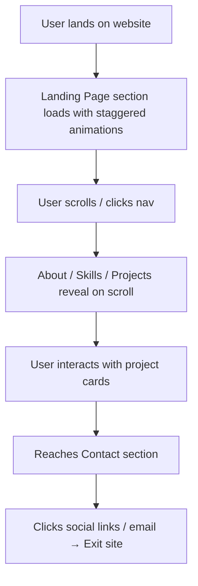

## 1. Product Overview

A modern, fun, and playful personal portfolio website for a programmer. The site showcases personality, skills, projects, and contact information with a programmer-themed aesthetic featuring purple, orange, and black colors.

* Purpose: Personal brand showcase for a developer; impress recruiters and connect with the tech community

* Target value: Stand out from generic portfolios with memorable visuals and delightful interactions

## 2. Core Features

### 2.2 Feature Module

1. **Home page**: Sticky navigation, Animated Hero, About section, Skills showcase, Projects grid, Contact section, Footer
2. **Interactive elements**: Typing animation, Code-themed decorations, Hover micro-interactions, Scroll-triggered reveals

### 2.3 Page Details

| Page Name | Module Name          | Feature description                                                                       |
| --------- | -------------------- | ----------------------------------------------------------------------------------------- |
| Home      | Sticky Navbar        | Smooth scroll links, theme toggle highlight, programmer logo/icon                         |
| Home      | Landing Page Section | Large name display, animated typing effect for roles, CTA buttons, floating code snippets |
| Home      | About Section        | Profile introduction with fun programmer facts, avatar with terminal-style border         |
| Home      | Skills Section       | Skill badges/cards with tech stack icons, animated progress indicators                    |
| Home      | Projects Section     | Project cards with tech tags, hover lift effect, links to GitHub/Demo                     |
| Home      | Contact Section      | Social links icons, email contact, fun contact form with terminal theme                   |
| Home      | Footer               | Copyright, quick links, fun programmer quote                                              |

## 3. Core Process

User lands on the page → Hero animations play on load → User scrolls through sections with staggered reveals → Clicks on nav links for smooth scrolling → Interacts with project cards and skill badges → Finds contact info or social links to connect.

## 4. User Interface Design

### 4.1 Design Style

* **Primary colors**: Deep Purple (#6B21A8 / #9333EA), Vibrant Orange (#F97316 / #FB923C), Black (#0A0A0A / #18181B)

* **Accents**: Light purple glows, orange highlights, dark card surfaces with subtle gradients

* **Button style**: Rounded pill buttons with gradient backgrounds; hover gives lift + glow effect; icon buttons have playful scale

* **Fonts**: Display font - JetBrains Mono (programmer monospace feel); Body font - clean sans-serif (e.g., Figtree or Space Grotesk variant)

* **Layout style**: Asymmetric grid with overlapping elements; dark background with neon-like glow accents; card-based components

* **Icon/emoji style**: Lucide icons with playful color accents; occasional programming-themed emojis (💻 ⚡🚀 ✨)

### 4.2 Page Design Overview

| Page Name | Module Name | UI Elements                                                                                                                                  |
| --------- | ----------- | -------------------------------------------------------------------------------------------------------------------------------------------- |
| Home      | Navbar      | Glassmorphism sticky bar, logo with `<Dev/>` tag, underline links on hover                                                                   |
| Home      | Hero        | Huge gradient text name, blinking cursor typing animation ("Full-Stack Dev", "UI Enthusiast", "Problem Solver"), floating curly braces decor |
| Home      | About       | Terminal window styled card with `$ whoami` prompt, two-column layout with text + avatar                                                     |
| Home      | Skills      | Hexagonal / rounded skill badges, hover pulse effect, grouped by category (Frontend, Backend, Tools)                                         |
| Home      | Projects    | Bento-style grid of project cards, each with tag pills, GitHub icon, external link icon                                                      |
| Home      | Contact     | Terminal-styled CTA box, social icons with hover rotation                                                                                    |
| Home      | Footer      | Subtle dark footer, animated typewriter-style quote                                                                                          |

### 4.3 Responsiveness

* Desktop-first design, full responsiveness down to mobile (360px)

* Grid collapses to single column on mobile; nav becomes hamburger menu

* Hero text scales down proportionally; spacing tightens on small screens

* Touch-friendly targets (min 44x44px) for all interactive elements on mobile

