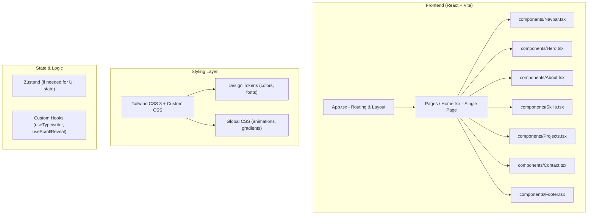

## 1. Architecture Design



## 2. Technology Description

* **Frontend**: React\@18 + TypeScript + Vite

* **Styling**: Tailwind CSS 3 + vanilla CSS (for custom keyframes / gradients)

* **Icons**: lucide-react (consistent icon set)

* **State**: Zustand (for simple UI state like mobile nav toggle)

* **Routing**: react-router-dom (for future multi-page expansion; single page now)

* **No backend**: Frontend-only; all content hardcoded as mock data in component files

## 3. Route Definitions

| Route | Purpose                           |
| ----- | --------------------------------- |
| /     | Main single-page portfolio (Home) |

## 4. Project Structure

```
src/
├── components/
│   ├── Navbar.tsx          # Sticky navigation with links
│   ├── LandingPage.tsx            # Lnding Page section with typing animation
│   ├── About.tsx           # About / bio section (terminal style)
│   ├── Skills.tsx          # Skills showcase grid
│   ├── Projects.tsx        # Projects bento grid
│   ├── Contact.tsx         # Contact section + social links
│   └── Footer.tsx          # Page footer
├── hooks/
│   ├── useTypewriter.ts    # Typing animation hook
│   └── useScrollReveal.ts  # Scroll-triggered reveal hook
├── data/
│   └── portfolio.ts        # Mock data for skills, projects, socials
├── pages/
│   └── Home.tsx            # Composed home page
├── App.tsx                 # Root component with routing
├── main.tsx                # Entry point
└── index.css               # Tailwind directives + custom CSS
```

## 5. Key Technical Decisions

1. **Vite** chosen for fast HMR and simple dev server
2. **Tailwind CSS** for rapid consistent styling; custom CSS for unique keyframe animations not achievable with utility classes
3. **TypeScript** for type safety and better developer experience
4. **Lucide icons** for a clean, consistent icon family
5. **Zustand** only if simple global state is needed (e.g., mobile menu toggle) — otherwise use local React state
6. **CSS custom properties** for theme tokens (purple/orange/black) so future theming is trivial
7. **CSS keyframes** over JS animation libraries for performance and simplicity

